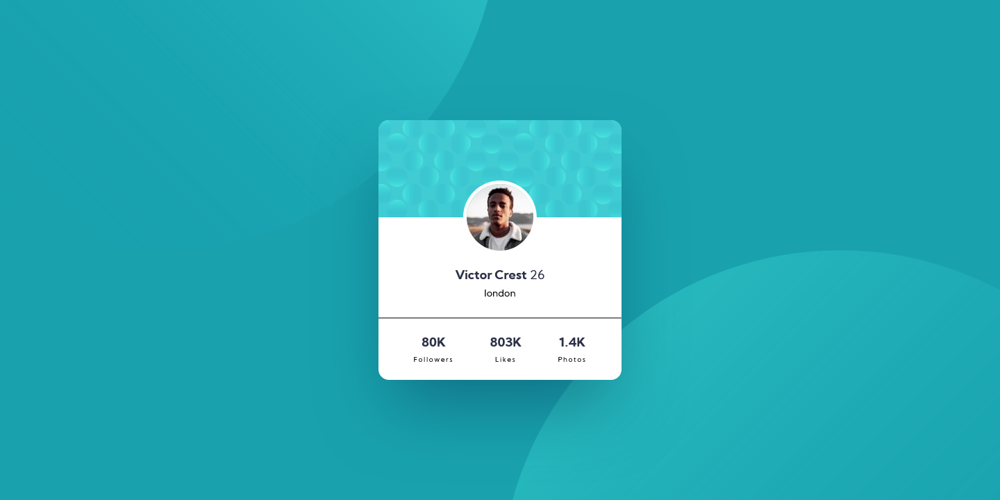
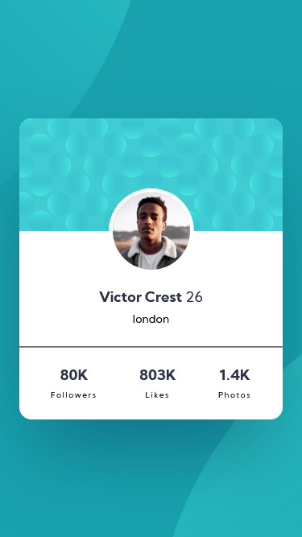

# Frontend Mentor - Profile card component

This is a solution to the [Profile card component](https://www.frontendmentor.io/challenges/profile-card-component-cfArpWshJ). Frontend Mentor challenges help you improve your coding skills by building realistic projects.

## Table of contents

- [Overview](#overview)
  - [The challenge](#the-challenge)
  - [Screenshot](#screenshot)
  - [Links](#links)
- [My process](#my-process)
  - [Built with](#built-with)
  - [What I learned](#what-i-learned)
- [Author](#author)

## Overview

### The challenge

Users should be able to:

- View the optimal layout for the site depending on their device's screen size

### Screenshot

### Links

- Live Site URL: [Live Site URL:](https://thirsty-engelbart-a8a601.netlify.app/)
- Solution URL: [Solution URL:](https://www.frontendmentor.io/solutions/profile-card-componment-html-and-css-Vk_EXSC04)

## My process

### Built with

- Semantic HTML5 markup
- CSS custom properties
- Flex box

### What I learned

I learned more about box shadow it was a cool thing, had basic idea on it but now more about and it structure which is :
box-shadow: offset-x | offset-y | blur-radius | spread-radius | color

## Author

<!-- - Website -  -->

- Frontend Mentor - [@Rezzak](https://www.frontendmentor.io/profile/errazakallah31)
- Twitter - [@Rezzak_48](https://twitter.com/Rezzak_48)
